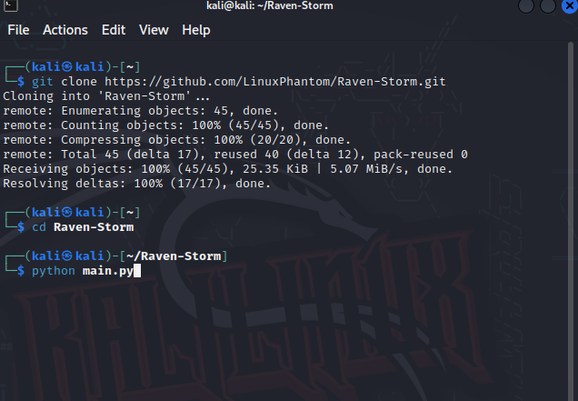
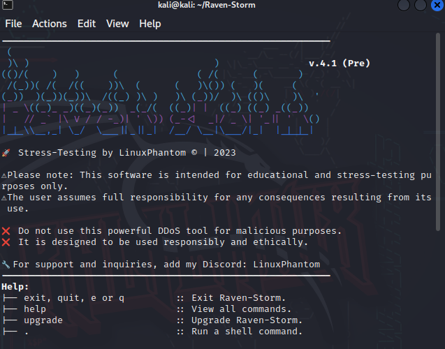
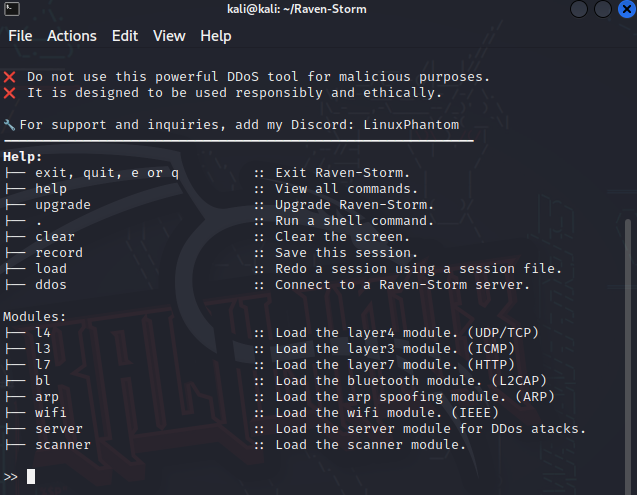

# Raven Storm DDoS 







# Getting Started

## Installation

To get started with Raven Storm, follow these steps:

### 1. Clone the repository using Git:

```bash
git clone https://github.com/LinuxPhantom/Raven-Storm.git

### 2. Navigate to the cloned Raven-Storm directory:
cd Raven-Storm

### 3. Launch Raven-Storm by running the main.py file:
python main.py

# Disclaimer
⚠️ Raven Storm is intended for educational and stress-testing purposes only. 
The user is solely responsible for any actions taken using this tool. 
Do not use Raven Storm for any malicious purposes or against systems you do not own or have proper authorization to test.

# Contributing
Contributions to Raven Storm are welcome! 
If you encounter any bugs or have suggestions for improvements, please open an issue on GitHub or submit a pull request.